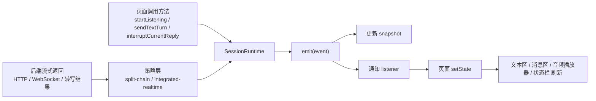

# SessionRuntime 深度理解手册

本文档专门用于帮助理解本项目中的 `SessionRuntime`。目标不是只解释几个方法名，而是把下面这些问题一次讲透：

- `SessionRuntime` 到底是什么
- 它为什么叫“统一会话运行时”
- `emit`、`onEvent`、`snapshot`、`listener` 分别是什么
- 文本输入、语音输入、实时通话这三类交互，到底是怎么统一起来的
- `split-chain` 和 `integrated-realtime` 两条链路，和 `SessionRuntime` 是什么关系
- 页面为什么能刷新文本、播放音频、显示状态

核心源码入口：

- `frontend/src/runtime/voice/sessionRuntime.ts`
- `frontend/src/runtime/voice/types.ts`
- `frontend/src/runtime/voice/splitStrategy.ts`
- `frontend/src/runtime/voice/integratedStrategy.ts`
- `frontend/src/pages/ChatCenterPage.tsx`

## 一句话先讲透

`SessionRuntime` 可以理解为“会话总调度器 + 状态中心 + 事件总线”。

它不直接等于后端，也不直接等于页面，更不只等于某一条语音链路。  
它做的是：

1. 统一接收各种输入和返回结果
2. 把这些输入和返回结果抽象成统一事件
3. 用这些事件更新当前会话状态 `snapshot`
4. 再把事件通知给页面和其他订阅方

如果要再缩成一句：

`方法触发流程，流程产生事件，事件驱动 snapshot，页面订阅事件并刷新界面。`

---

## 第一部分：先建立最稳的心智模型

### 1. `SessionRuntime` 不是“后端”，也不是“页面”

可以把项目分成 4 层：

1. 页面层
2. 运行时层
3. 策略层
4. 后端层

对应关系如下：

- 页面层：`ChatCenterPage.tsx`
- 运行时层：`SessionRuntime`
- 策略层：`SplitChainStrategy`、`IntegratedRealtimeStrategy`
- 后端层：HTTP 流式接口、WebSocket 实时接口、语音转写接口

页面层负责：

- 用户点按钮
- 显示文本
- 播放音频
- 展示状态和指标

运行时层负责：

- 统一维护当前会话状态
- 统一处理文本、语音、打断、指标
- 统一把事件广播给页面

策略层负责：

- 语音相关的具体实现
- 比如浏览器语音识别、后端转写、WebSocket 实时音频发送

后端层负责：

- 真正的模型调用
- 检索增强
- 文本流式返回
- 音频返回
- WebSocket 实时交互

所以：

`SessionRuntime` 是前端内部的“会话调度核心”，它在页面和后端之间居中。`

### 2. 你必须区分 4 个词

这 4 个词非常容易混：

- 方法
- 事件
- 快照
- 订阅者

它们的关系如下。

#### 方法

方法表示“我现在要发起一个动作”。

例如：

- `startListening()`
- `stopListening()`
- `sendTextTurn()`
- `interruptCurrentReply()`
- `applyLiveConfig()`

这些都属于命令式入口。

#### 事件

事件表示“刚刚发生了一件事”。

例如：

- `user.transcript.partial`
- `user.transcript.final`
- `assistant.text.delta`
- `assistant.text.final`
- `assistant.audio.started`
- `assistant.audio.delta`
- `assistant.audio.stopped`
- `assistant.interrupted`

这些都定义在 `types.ts` 的 `RuntimeEventMap` 里。

#### 快照

快照就是 `SessionRuntime` 当前内部维护的总状态，类型是 `RuntimeSnapshot`。

它里面有：

- `sessionId`
- `mode`
- `studioState`
- `transcript`
- `messages`
- `metrics`
- `listening`

它表示：

`此时此刻，这个会话在 runtime 看来到底是什么状态。`

#### 订阅者

订阅者不是某个按钮，也不是某个文本框。  
订阅者本质上是一个函数。

它通过：

- `runtime.onEvent(listener)`

注册进去。  
以后每次 runtime 发出事件，这个函数都会被调用。

本项目里最典型的订阅者就是 `ChatCenterPage` 中注册的那个回调函数。

---

## 第二部分：`emit` 到底是什么

### 1. 先用生活语言理解

`emit` 可以直接翻成：

- 发出
- 广播
- 通知

在这里它的意思是：

`现在发生了一件事，我要把这件事提交给 runtime 统一处理。`

例如：

- 用户文本已经确定了
- 助手返回了一小段文本
- 助手音频开始了
- 用户打断了助手回复

这些事情都可以表示成：

```ts
emit("某个事件名", { 某些数据 })
```

### 2. 为什么很多地方都有 `emit`

因为不同来源都想把信息送进同一个运行时系统。

来源包括：

- 页面主动发起
- `sendTextTurn()` 内部流程
- 浏览器语音识别结果
- 后端转写结果
- WebSocket 返回结果
- 中断逻辑

它们最终都要统一进入：

- `SessionRuntime.emit(...)`

所以你会看到“到处都有 emit”，但这些 emit 的目标其实是一致的：

`把不同来源的信息，统一交给 runtime。`

### 3. `emit` 干了什么

它做两步：

1. 根据事件类型更新 `snapshot`
2. 把事件通知给所有订阅者

也就是说：

```text
收到事件
-> 更新内部状态 snapshot
-> 广播给所有 listener
```

这是理解整个运行时最关键的一步。

---

## 第三部分：快照 `snapshot` 是怎么更新的

### 1. 不是监听器改的

很多人第一次看事件系统会误以为：

“监听器监听到了什么，然后去改快照。”

这在本项目里是不对的。

这里的正确顺序是：

1. runtime 收到一个事件
2. runtime 自己先改 `snapshot`
3. 然后才通知监听器

所以：

`快照更新的直接触发器是 emit(event)，不是 listener。`

### 2. 更新依据是什么

更新依据有两个：

1. 事件类型 `type`
2. 事件携带的数据 `payload`

例如：

```ts
emit("user.transcript.final", { text: "你好", turn_id: "turn-1" })
```

这里：

- 事件类型告诉 runtime：这是“用户最终输入”
- `payload.text` 告诉 runtime：最终输入文本就是“你好”

于是 runtime 就会：

- 更新 `snapshot.transcript`
- 更新用户消息列表
- 重置当前助手消息标识

### 3. 典型更新规则

#### 规则一：用户中间转写

事件：

- `user.transcript.partial`

效果：

- 修改 `snapshot.transcript`
- 更新最后一条用户消息为 partial

#### 规则二：用户最终转写

事件：

- `user.transcript.final`

效果：

- 修改 `snapshot.transcript`
- 把用户消息标记为 final
- 为下一条助手消息做好准备

#### 规则三：助手文本增量

事件：

- `assistant.text.delta`

效果：

- 如果助手消息不存在，就创建
- 如果已存在，就追加/覆盖成当前文本

#### 规则四：助手被打断

事件：

- `assistant.interrupted`

效果：

- 当前助手消息被标记为 `interrupted`
- 不再保持 partial 状态

#### 规则五：指标更新

事件：

- `metrics.turn`
- `metrics.retrieval`

效果：

- 更新 `snapshot.metrics`

---

## 第四部分：页面为什么会刷新

### 1. 刷新页面不是因为“快照自动绑定”

这里不是 Vue 那种直接改对象就自动渲染的思路。  
这里的刷新逻辑是：

1. runtime 更新快照
2. runtime 把事件广播出去
3. 页面收到事件
4. 页面根据事件调用 React 的 `setState`
5. React 重新渲染

### 2. 订阅者是谁

订阅者不是输入框，不是消息框，也不是音频播放器本身。  
订阅者是 `ChatCenterPage` 中注册进去的回调函数。

也就是说：

- 页面逻辑是订阅者
- 文本框、消息列表、音频播放器只是页面渲染出来的结果

### 3. 如何订阅

通过：

```ts
runtime.onEvent((event) => {
  // 根据 event 更新页面状态
})
```

注册后，这个函数会被加入 `listeners` 集合。  
以后每次 runtime 发事件，都会调用它。

### 4. “助手回复的内容是不是通知过去的”

是的。

例如助手流式生成一段文本：

1. runtime 先更新 `snapshot.messages`
2. 然后广播事件 `assistant.text.delta`
3. 页面收到这个事件
4. 页面把 `event.payload.text` 写到草稿区或消息区

因此：

`助手回复内容既会进入 snapshot，也会作为事件数据通知给页面。`

---

## 第五部分：4 个核心方法到底是什么

### 1. `applyLiveConfig()`

作用：

- 修改当前运行配置

主要改这些：

- `mode`
- `splitAsr`
- `feature`
- `autoSubmitVoiceTurns`

它解决的问题是：

`同一个 runtime，在不同使用场景下应该怎么跑。`

例如：

- 是语音输入还是实时通话
- 是走 `split-chain` 还是 `integrated-realtime`

### 2. `startListening()`

作用：

- 启动语音监听流程

它本身不等于“开始回答”，而是：

- 让语音策略开始工作
- 打开浏览器识别或麦克风采集
- 或建立 WebSocket 实时链路

### 3. `sendTextTurn()`

作用：

- 发起一轮文本回合

这既可以来自用户手动输入文本，也可以来自语音转写完成后的自动提交。

这个方法很重要，因为它说明：

`SessionRuntime 不只是管实时通话，它也直接管文本回合。`

### 4. `interruptCurrentReply()`

作用：

- 打断当前助手回复

它会：

- 先终止当前文本流或音频流
- 再调用当前策略的 `interrupt()`
- 最后记录打断延迟指标

### 5. `stopListening()`

作用：

- 停止语音相关能力

例如：

- 关闭浏览器识别
- 关闭录音
- 关闭 WebSocket
- 把状态回到 idle

---

## 第六部分：两条语音链路和 runtime 的关系

### 1. 不是 runtime 只服务它们

你最容易误解的一点就是：

“runtime 是不是只为了两条语音链路存在？”

不是。

更准确的关系是：

- `SessionRuntime` 是统一会话运行时
- 两条语音链路是它下面的两种语音策略

也就是说：

`策略是 runtime 的下属模块，而不是 runtime 的全部。`

### 2. `split-chain` 是什么

它更像“分阶段管线”：

1. 先语音识别
2. 再得到文本
3. 再把文本提交给文本回合
4. 再等助手回复文本或音频

这个模式可以：

- 用浏览器语音识别
- 用后端转写

所以普通“语音输入转文字”常常会走这条路。

### 3. `integrated-realtime` 是什么

它更像“实时全双工链路”：

1. 前端持续采集音频
2. WebSocket 实时发给后端
3. 后端实时回转写、回文本、回音频
4. 还支持自动插话打断

所以实时通话更适合走这条路。

### 4. `voice-input` 和 `realtime-call` 又是什么

这两个不是“链路模式”，而是“功能模式”。

- `voice-input`
  含义：我要做语音输入
- `realtime-call`
  含义：我要做实时通话

而 `mode` 才是链路模式：

- `split-chain`
- `integrated-realtime`

所以：

- `feature` 决定“我要什么语音能力”
- `mode` 决定“这项能力通过哪种技术策略实现”

---

## 第七部分：4 个完整例子

## 例子一：用户手动输入文本并发送

链路如下：

1. 页面点击发送
2. 页面调用 `runtime.sendTextTurn(text)`
3. runtime 主动发出 `user.transcript.final`
4. runtime 更新 `snapshot.transcript` 和用户消息
5. runtime 通知页面
6. 页面显示用户这条消息
7. 后端开始流式返回助手文本
8. runtime 连续发出 `assistant.text.delta`
9. runtime 更新助手消息
10. runtime 通知页面
11. 页面显示助手的流式文本
12. 本轮完成后发 `assistant.text.final` 和 `metrics.turn`

关键理解：

- 文本输入在 runtime 看来，也是一种“最终输入事件”
- 所以文本和语音最终都能收敛到同一个回合模型

## 例子二：普通语音输入，浏览器 ASR 成功

链路如下：

1. 页面启动 `voice-input`
2. `applyLiveConfig()` 设定 feature 和 mode
3. `startListening()` 启动 `split-chain`
4. 浏览器语音识别持续给出中间结果
5. strategy 调用 `ctx.emit("user.transcript.partial", ...)`
6. runtime 更新 transcript 和 partial 用户消息
7. 浏览器识别得到最终文本
8. strategy 调用 `ctx.emit("user.transcript.final", ...)`
9. runtime 更新最终文本
10. 如果开启自动提交，则 strategy 再调用 `ctx.sendTextTurn(...)`
11. 文本回合开始

关键理解：

- 这里的“语音输入”不是直接回答
- 它是先变成文本，再进入统一文本回合

## 例子三：实时通话模式

链路如下：

1. 页面启动 `realtime-call`
2. `applyLiveConfig()` 设定 feature=`realtime-call`
3. `startListening()` 启动 `integrated-realtime`
4. strategy 建立 WebSocket
5. strategy 打开麦克风，持续采样音频
6. 音频被编码后通过 WebSocket 发给后端
7. 后端不断回：
   - 用户中间转写
   - 用户最终转写
   - 助手文本增量
   - 助手音频分片
8. strategy 根据 `eventName` 调用 `ctx.emit(...)`
9. runtime 更新 snapshot
10. 页面收到事件并刷新

关键理解：

- 这里不是“先识别成完整文本再发送”
- 而是更接近实时双向会话

## 例子四：用户打断助手

链路如下：

1. 页面点击打断按钮
2. 调用 `runtime.interruptCurrentReply()`
3. runtime 先终止当前文本流
4. runtime 发出 `assistant.interrupted`
5. runtime 再调用当前策略的 `interrupt()`
6. 如果是 WebSocket 链路，就发 `response.cancel`
7. 页面收到 `assistant.interrupted`
8. 页面停止播放音频
9. studioState 回到 listening 或 idle

关键理解：

- 打断本质上也是一个事件
- 它不只是“停声音”，还要影响消息状态和指标统计

---

## 第八部分：最容易混淆的点

### 误区 1：监听器负责修改 snapshot

错误。

正确的是：

- runtime 先改 snapshot
- 监听器只是收到通知

### 误区 2：文本框就是订阅者

错误。

正确的是：

- 页面逻辑里的回调函数是订阅者
- 文本框只是显示结果

### 误区 3：`emit` 就等于“发给后端”

错误。

这里的 `emit` 主要是前端 runtime 内部事件机制。

发给后端的动作可能是：

- HTTP 请求
- WebSocket 发送
- 策略内部调用 `send(...)`

而 `emit` 是：

- 把某件事抽象成 runtime 事件

### 误区 4：runtime 只服务实时通话

错误。

它也直接管理：

- 手动文本发送
- 普通语音输入
- 助手文本流式回复
- 助手音频播放事件

### 误区 5：`feature` 和 `mode` 是一回事

错误。

- `feature`：我要做什么功能
- `mode`：我用什么链路实现

---

## 第九部分：连环问题与连续回答

下面这组问题故意写得很“啰嗦”，因为真正理解运行时，往往就是靠这种连续追问。

### Q1：`SessionRuntime` 到底是不是一个类？

是。  
它是一个前端类实例，页面会创建它并长期持有它。

### Q2：它为什么不直接写在页面里？

因为文本、语音、实时通话、打断、指标这些逻辑太复杂。  
如果直接写在页面里，页面会同时耦合：

- 后端流式协议
- WebSocket 协议
- 音频播放
- 语音识别
- 状态同步

这会非常乱。

### Q3：那 runtime 最核心的职责是什么？

统一管理会话过程。

### Q4：统一的到底是什么？

统一的是：

- 输入事件
- 助手输出事件
- 状态变化
- 指标统计

### Q5：`snapshot` 是不是“当前会话状态对象”？

是。

### Q6：`snapshot` 里最重要的字段是什么？

- `studioState`
- `transcript`
- `messages`
- `metrics`

### Q7：`studioState` 是什么？

它是当前工作状态，例如：

- `idle`
- `listening`
- `thinking`
- `speaking`
- `error`

### Q8：`messages` 是真实聊天记录吗？

更准确地说，它是 runtime 维护的前端会话消息状态。  
它和后端数据库消息相关，但不是一回事。

### Q9：为什么需要 `partial` 和 `final`？

因为语音转写和助手流式生成都不是一次性完成的。  
需要区分：

- 这条内容还在变
- 这条内容已经结束

### Q10：`emit` 为什么不是直接叫 `updateState`？

因为它不只改状态，还要广播事件。  
它是“状态更新 + 事件通知”的入口。

### Q11：是不是所有事情都要经过 `emit`？

在这个运行时模型里，和会话相关的关键变化基本都希望转成事件，再经过 `emit`。

### Q12：为什么同一件事要“先改 snapshot，再通知页面”？

因为页面收到通知时，runtime 内部状态最好已经一致。  
否则页面拿到事件后去查 snapshot，可能还是旧值。

### Q13：订阅者拿到的是什么？

拿到的是事件对象：

- `type`
- `payload`
- `at`

### Q14：页面怎么知道这是助手文本，不是用户文本？

看 `event.type`。  
例如：

- `assistant.text.delta`
- `user.transcript.final`

### Q15：页面收到事件后为什么还要自己 setState？

因为 React 不会自动读取 runtime 内部对象来刷新。  
页面必须显式更新 React 状态。

### Q16：那页面为什么不直接每次读 `runtime.getSnapshot()`？

可以读，但只靠轮询读快照很笨。  
事件通知更及时，也更适合做增量更新。

### Q17：文本发送为什么也会发 `user.transcript.final`？

因为在 runtime 的抽象里，文本输入和语音最终识别结果，本质上都属于“用户最终输入已确定”。

### Q18：所以 runtime 真正统一的是“回合模型”？

对，这个说法非常准。  
它统一的是“会话回合”。

### Q19：什么叫回合模型？

一轮对话通常包含：

1. 用户输入
2. 助手生成
3. 助手播报
4. 可能被打断
5. 指标统计

runtime 统一管理的就是这一轮轮过程。

### Q20：普通语音输入一定是浏览器识别吗？

不一定。  
在 `split-chain` 下：

- 可能是浏览器 ASR
- 也可能退回后端转写

### Q21：实时通话模式一定走 WebSocket 吗？

在 `integrated-realtime` 策略里，是的。  
这是它的主要实现方式。

### Q22：`ctx.emit(...)` 和 `runtime.onEvent(...)` 有什么区别？

- `ctx.emit(...)`：是策略层往 runtime 里“送事件”
- `runtime.onEvent(...)`：是页面层从 runtime 里“收事件”

一个是上游输入，一个是下游订阅。

### Q23：谁可以调用 `emit`

主要是 runtime 自己和策略上下文。  
页面通常不直接乱发内部事件，而是调用 runtime 的公开方法。

### Q24：音频播放是谁做的？

不是 runtime 直接播。  
runtime 发出 `assistant.audio.delta`，页面收到后：

- 如果是 PCM 音频，就交给 `PcmStreamPlayer`
- 如果是普通音频 base64，就塞进音频队列播放

### Q25：为什么说页面不是直接绑定后端协议

因为页面不直接写：

- “如果后端 WebSocket 回 `assistant.text.delta` 我就怎么处理”

而是统一写成：

- “如果 runtime 事件是 `assistant.text.delta` 我就怎么处理”

这让页面和具体后端协议解耦。

### Q26：如果以后换后端协议，页面是不是可以少改？

对，这正是运行时抽象的价值之一。

### Q27：为什么要有 `currentAssistantMessageId`

因为助手文本是流式返回的。  
runtime 要知道：

“这一段 delta 应该更新哪一条助手消息。”

### Q28：为什么打断时也要走事件

因为打断不只是“停一下”，它会影响：

- 当前消息状态
- 音频播放
- studioState
- metrics

### Q29：`snapshot` 和数据库消息的关系是什么？

数据库消息是后端持久化数据。  
`snapshot.messages` 是前端运行时视角下的当前消息状态。  
二者相关，但职责不同。

### Q30：如果我要向老师解释 `SessionRuntime`，最短怎么说？

可以这样说：

`SessionRuntime 是前端用于统一管理文本对话、语音输入和实时通话的会话运行时。它通过事件机制把不同交互链路抽象成一致的回合模型，内部维护当前会话快照，并向页面广播状态变化和消息增量，从而降低页面与具体后端协议的耦合。`

---

## 第十部分：建议你自己再做一遍的 8 个小练习

为了真正吃透，建议你亲自带着源码做这 8 个问题。

1. 找到 `RuntimeSnapshot` 的定义，逐个解释每个字段的含义。
2. 找到 `emit("user.transcript.final", ...)` 出现的地方，想清楚它为什么既适用于文本也适用于语音。
3. 找到页面 `onEvent(...)` 的注册位置，看看它分别如何处理文本、音频和指标。
4. 找到 `split-chain` 中浏览器识别成功的路径，画出一次完整的调用链。
5. 找到 `integrated-realtime` 中 WebSocket 收到 `assistant.audio.delta` 后的处理链。
6. 找到 `interruptCurrentReply()` 调用的后续流程，确认打断会影响哪些状态。
7. 比较 `voice-input` 和 `realtime-call` 两种 feature 的差异。
8. 比较 `split-chain` 和 `integrated-realtime` 两种 mode 的差异。

---

## 第十一部分：一张总图



---

## 最后一段总结

如果你读到这里，只记住下面 5 句话也够用了：

1. `SessionRuntime` 是统一会话运行时，不只是某条语音链路。
2. 方法负责发起流程，事件负责描述发生了什么。
3. `emit(event)` 是运行时处理事件的统一入口。
4. runtime 会先更新 `snapshot`，再把事件通知给页面。
5. 页面不是直接绑后端协议，而是订阅 runtime 事件并刷新界面。

如果后面你继续深挖，最值得反复咀嚼的三句是：

- `文本输入和语音最终输入，在 runtime 里被统一成同一种“用户最终输入事件”。`
- `双语音链路是 runtime 的策略实现，不是 runtime 的全部。`
- `页面消费的是 runtime 事件，而不是具体后端协议。`
